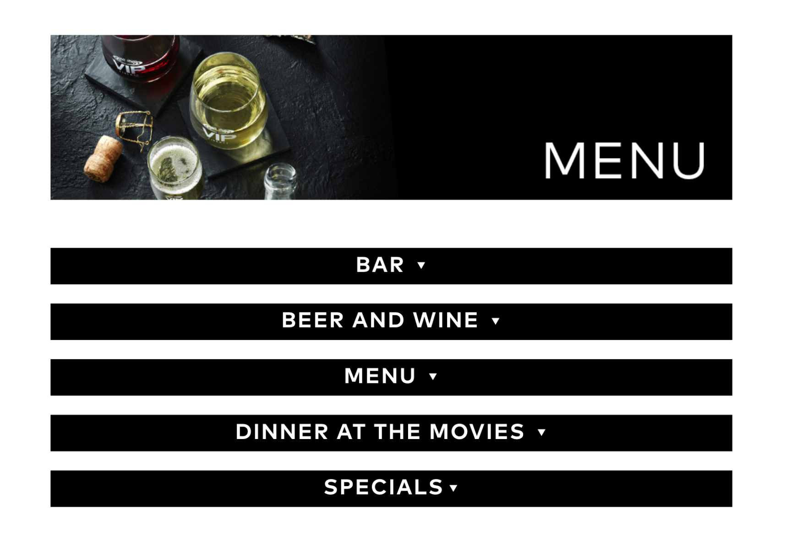
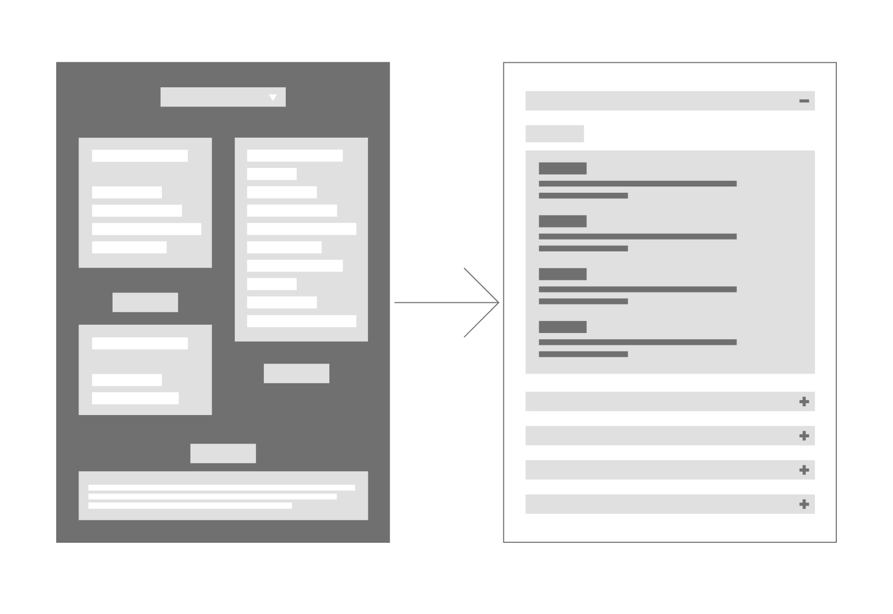
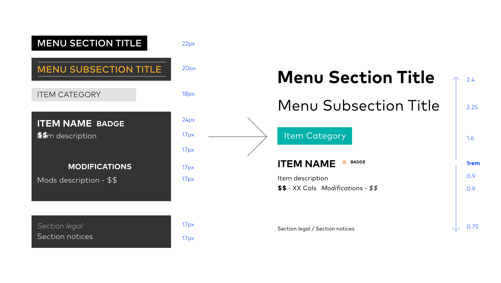
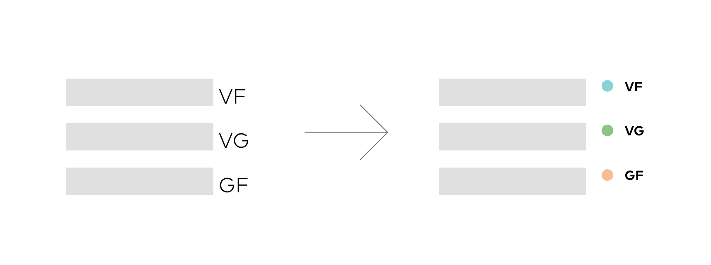
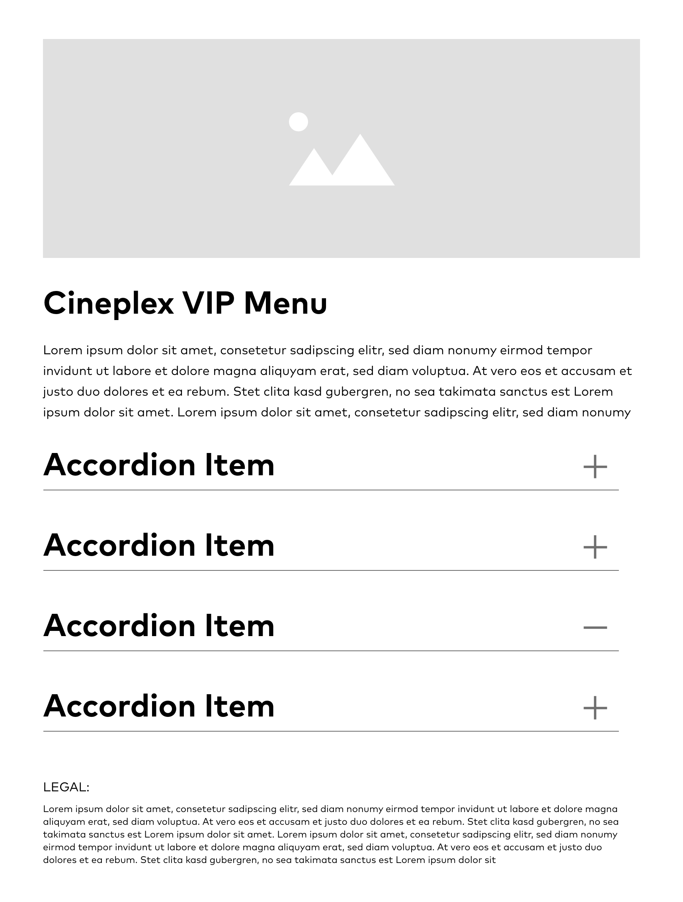
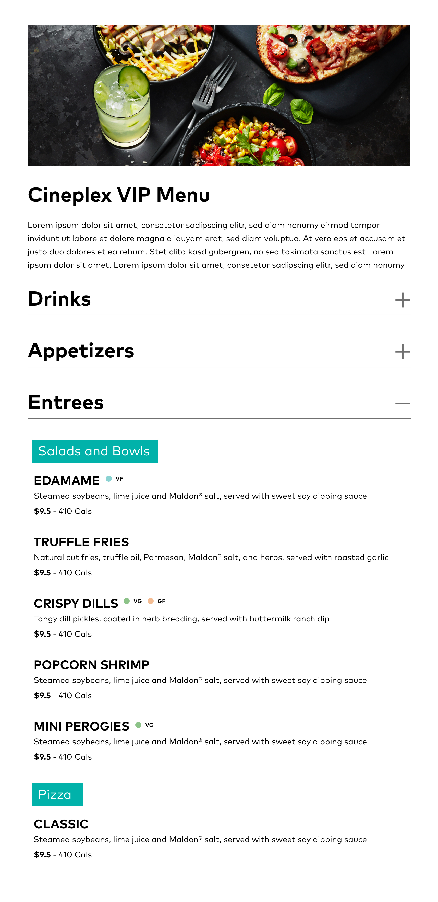
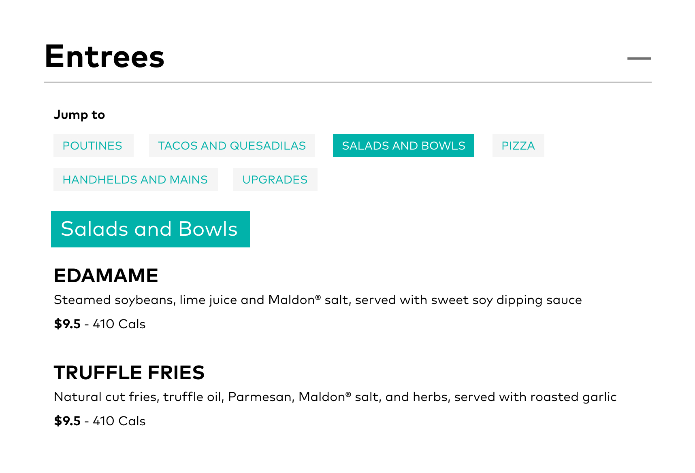
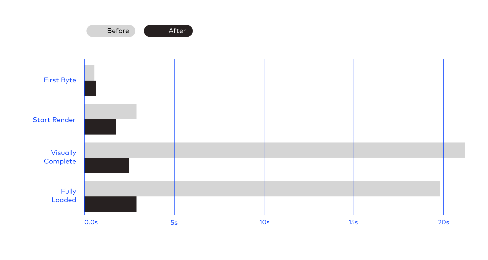

The Cineplex VIP program is Canada’s leading premium experience in movie theatres. Working directly with the VIP marketing team, I was asked to come up with a more elegant and functional solution to the online menu they had implemented a few years ago.

The main issue was how extensive the VIP Menu is &mdash; a long scroll of items hard to categorize , especially in a mobile screen.  Implementing a search and filter feature was never an option due to the limitations of the CMS as it would involve too many external resources. We had to implement the best solution possible with the least amount of code and impact on performance.

### Layout
{: .intro .title .is-2 .has-text-weight-normal .has-line-spacing-tall}

Considering the large amount of information we had to display, quick scanning for items was a fundamental part of accessing the page. I wanted users to immediately be able to understand how information is structured so they could jump to decision making right away. 

*Layout before the changes*

We achieved this by changing from a multi column layout to a simpler list, decreasing significantly the height of each item and showing more content right away.

*Before: multi column -> After: list layout*

### Typography
{: .intro .title .is-2 .has-text-weight-normal .has-line-spacing-tall}

Another point of interest in this project was how typography was working against functionality by providing so many different components. I chose to simplify the type components here so they would make more sense in a structured list and could also serve as a reference point for quick scanning the whole menu.

*Type elements: before -> after*

*Dietary restrictions badges: before -> after*

### Functionality
{: .intro .title .is-2 .has-text-weight-normal .has-line-spacing-tall}

*Revamped accordion layout*

After some research, I understood that the accordion functionality was still the best one to go here. Being able to expand and collapse sections was a good way of letting users know where they were in the extensive list, while providing a quick access to another categories. 

*High fidelity  wireframes ready for development*

I decided to change the implementation a bit with a ‘Jump to’ sub menu inside each category that would allow users to quickly scan and locate items of interest.

*Jump Menu implementation*

### KPIs:
{: .intro .title .is-2 .has-text-weight-normal .has-line-spacing-tall}

**75% less CSS** by refactoring the whole stylesheet and taking advantage of top level Bootstrap already loaded in the page by default;

**95% less JavaScript** by getting rid of all external JS libraries and opting for a vanilla implementation instead of jQuery;

**Google Pagespeed Insights** score went from **5** to **79** by removing blocking resources and optimizing image data.

*Before and After: Performance improvements*
